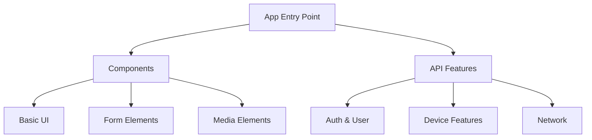
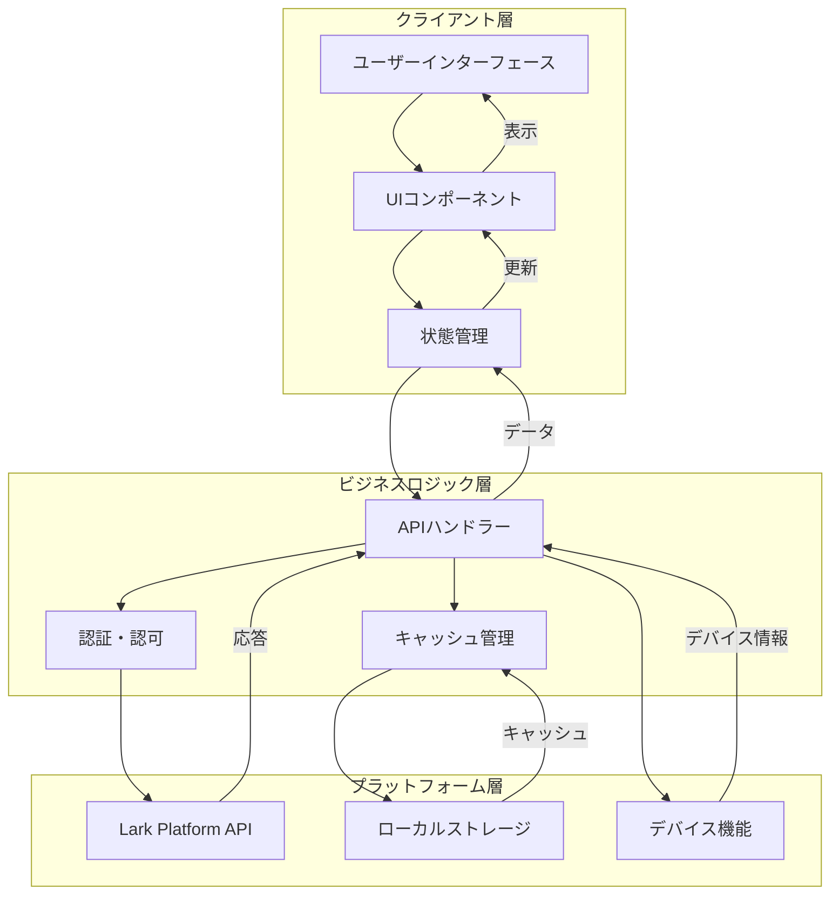

# Larkミニプログラム プロジェクト概要ドキュメント

## 1. プロジェクト概要

### 目的
このプロジェクトは、Lark（飛書）プラットフォーム向けのミニプログラムを開発するためのものです。ミニプログラムは、Larkプラットフォーム内で動作する軽量なアプリケーションとして機能します。

### 背景
Larkプラットフォームのエコシステムを活用し、ユーザーに対してよりシームレスな体験を提供するために開発されています。

### 現状
プロジェクトは以下の主要な機能を提供しています：
- コンポーネントライブラリの実装
- APIの実装と例示
- ユーザーインターフェース要素の提供
- 各種プラットフォーム機能へのアクセス

## 2. プロジェクト構成

### ディレクトリ構造
```
lark-apps/
├── app.js              # アプリケーションのメインエントリーポイント
├── app.json            # アプリケーションの設定ファイル
├── app.ttss            # グローバルスタイルシート
├── config.js           # 設定ファイル
├── image/              # 画像リソースディレクトリ
├── page/               # ページコンポーネントディレクトリ
├── project.config.json # プロジェクト設定ファイル
└── util/              # ユーティリティ関数ディレクトリ
```

## 3. 技術スタック

### フレームワークとランタイム
- Lark Mini Program Framework (libVersion: 1.9.1)
- JavaScript (ES6対応)

### 開発環境設定
```json
{
  "urlCheck": false,
  "es6": true,
  "postcss": true,
  "minified": true,
  "newFeature": true
}
```

## 4. 主要コンポーネントと機能

### UIコンポーネント
- 基本要素（view, scroll-view, swiper）
- フォーム要素（button, checkbox, form, input）
- メディア要素（image, video）
- インタラクティブ要素（navigator, picker）
- リッチコンテンツ（richtext, editor）

### API機能
1. **認証・ユーザー情報**
   - ログイン管理
   - セッション管理
   - ユーザー情報取得

2. **デバイス機能**
   - 位置情報
   - カメラ・スキャン
   - ファイルシステム
   - ネットワーク状態

3. **UI操作**
   - ナビゲーションバー制御
   - モーダル・トースト表示
   - アクションシート

4. **通信機能**
   - HTTP リクエスト
   - WebSocket
   - ファイルアップロード/ダウンロード

## 5. アプリケーションの構造



## 5.1 データフロー



## 5.2 データフローの説明

1. **クライアント層**
   - ユーザーインターフェース: ユーザーとの直接的なインタラクション
   - UIコンポーネント: 再利用可能なUI要素の管理
   - 状態管理: アプリケーションの状態とデータの一時保持

2. **ビジネスロジック層**
   - APIハンドラー: プラットフォームAPIとの通信制御
   - 認証・認可: ユーザー認証と権限管理
   - キャッシュ管理: パフォーマンス向上のためのデータキャッシュ

3. **プラットフォーム層**
   - Lark Platform API: Larkプラットフォームとの通信
   - ローカルストレージ: デバイス上のデータ永続化
   - デバイス機能: ハードウェア機能へのアクセス

4. **主要なデータフロー**
   - ユーザーアクション → UIコンポーネント → 状態更新
   - API要求 → 認証 → プラットフォーム通信
   - データキャッシュ → ローカルストレージ保存
   - プラットフォームレスポンス → 状態更新 → UI更新

## 6. 開発プロセス

### 開発環境のセットアップ
1. Lark開発者ツールのインストール
2. プロジェクトの初期化
3. 開発者アカウントの設定（appid: cli_a701fc61a7b8d02d）

### 開発フロー
1. ローカル開発
2. デバッグ・テスト
3. コード審査
4. デプロイ

## 7. 重要な注意点

1. **セキュリティ**
   - ユーザー認証の適切な実装
   - APIキーの安全な管理
   - データの適切な暗号化

2. **パフォーマンス**
   - コードの最小化が有効
   - ES6最適化の活用
   - 適切なキャッシュ戦略の実装

3. **互換性**
   - Larkプラットフォームのバージョン要件の遵守
   - クロスプラットフォームの考慮

## 8. 今後の開発方針

1. コンポーネントライブラリの拡充
2. API機能の拡張
3. パフォーマンス最適化
4. ユーザー体験の向上

## 9. トラブルシューティング

一般的な問題の解決方法：
1. 開発者ツールのコンソールでエラーを確認
2. プロジェクト設定の確認
3. 依存関係の確認
4. ネットワーク接続の確認

## 10. 参考リソース

- [Lark開発者ドキュメント](https://open.larksuite.com/document/)
- プロジェクト内のサンプルコード（`page/component/`および`page/API/`ディレクトリ）

このドキュメントは、プロジェクトの現状を基に作成されています。新しい機能や変更が加えられた場合は、適宜更新が必要です。
